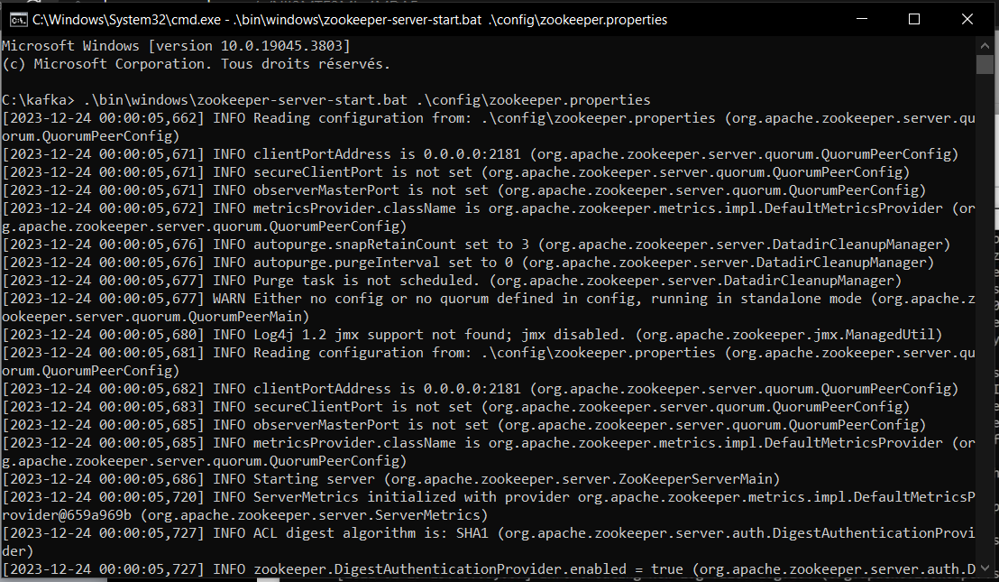

# Activité pratique N° 1 : Event Driven Architecture

## Partie 1 : Kafka

### 1.1 Installation de Kafka
Sur le site officiel de Kafka, télécharger la dernière version de Kafka. 

### 1.2 Lancement de Kafka et Zookeeper

```bash
start .\bin\windows\zookeeper-server-start.bat .\config\zookeeper.properties
```



```bash
start .\bin\windows\kafka-server-start.bat .\config\server.properties
```


