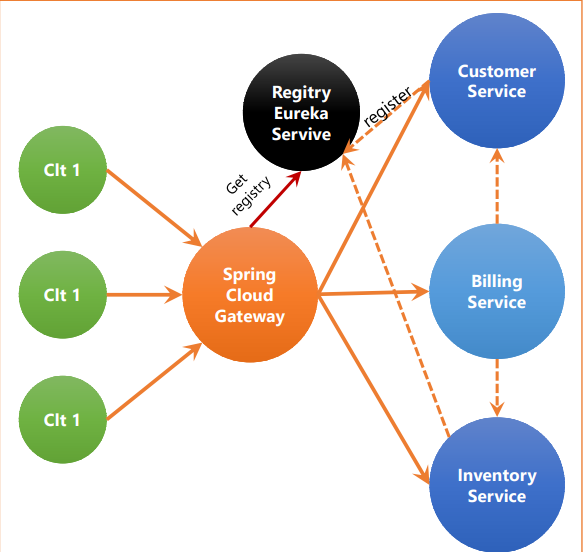

## Activité pratique N°2 : Architectures Micro-services avec Spring cloud 

####  énoncé : 


####  Architecture : 


####  Micro-service Customer-service :  
  * les dependencies de notre TP
  ```bash
   <dependencies>
        <dependency>
            <groupId>org.springframework.boot</groupId>
            <artifactId>spring-boot-starter-data-rest</artifactId>

        </dependency>
        <dependency>
            <groupId>org.springframework.boot</groupId>
            <artifactId>spring-boot-starter-web</artifactId>
        </dependency>
        <dependency>
            <groupId>org.springframework.cloud</groupId>
            <artifactId>spring-cloud-starter-netflix-eureka-client</artifactId>
        </dependency>

        <dependency>
            <groupId>org.springframework.boot</groupId>
            <artifactId>spring-boot-devtools</artifactId>
            <scope>runtime</scope>
            <optional>true</optional>
        </dependency>
        <dependency>
            <groupId>com.h2database</groupId>
            <artifactId>h2</artifactId>
            <scope>runtime</scope>
        </dependency>
        <dependency>
            <groupId>org.projectlombok</groupId>
            <artifactId>lombok</artifactId>
            <optional>true</optional>
        </dependency>
        <dependency>
            <groupId>org.springframework.boot</groupId>
            <artifactId>spring-boot-starter-test</artifactId>
            <scope>test</scope>
        </dependency>
        <dependency>
            <groupId>org.springframework.boot</groupId>
            <artifactId>spring-boot-starter-data-jpa</artifactId>
        </dependency>
    </dependencies>
    <dependencyManagement>
        <dependencies>
            <dependency>
                <groupId>org.springframework.cloud</groupId>
                <artifactId>spring-cloud-dependencies</artifactId>
                <version>${spring-cloud.version}</version>
                <type>pom</type>
                <scope>import</scope>
            </dependency>
        </dependencies>
  ```
  * le fichier application properties
 ```bash
 server.port=8087
 spring.application.name=customer-service
 spring.datasource.url=jdbc:h2:mem:DB_Customer
 spring.cloud.discovery.enabled=true
  ```
  *  l’entité Customer
```bash
package com.Ouadouch.customerservice.entities;
import jakarta.persistence.Entity;
import jakarta.persistence.GeneratedValue;
import jakarta.persistence.GenerationType;
import jakarta.persistence.Id;
import lombok.AllArgsConstructor;
import lombok.Data;
import lombok.NoArgsConstructor;
import lombok.ToString;
@Entity //pour JPA
@Data @AllArgsConstructor @NoArgsConstructor @ToString
public class Customer {
    @Id @GeneratedValue(strategy = GenerationType.IDENTITY)
    private Long id;
    private String name;
    private String email;
}

  ```
  * l’interface CustomerRepository basée sur Spring Data
   ```bash
package com.Ouadouch.customerservice.repositories;

import com.Ouadouch.customerservice.entities.Customer;
import org.springframework.data.jpa.repository.JpaRepository;
import org.springframework.data.rest.core.annotation.RepositoryRestResource;
@RepositoryRestResource
public interface CustomerRepository extends JpaRepository<Customer,Long> {
}
  ```
  * enregistrer quelque customer
```bash
package com.Ouadouch.customerservice;

import com.Ouadouch.customerservice.entities.Customer;
import com.Ouadouch.customerservice.repositories.CustomerRepository;
import org.springframework.boot.CommandLineRunner;
import org.springframework.boot.SpringApplication;
import org.springframework.boot.autoconfigure.SpringBootApplication;
import org.springframework.context.annotation.Bean;
import org.springframework.data.rest.core.config.RepositoryRestConfiguration;

import java.util.stream.Stream;

@SpringBootApplication
public class CustomerServiceApplication {

    public static void main(String[] args) {
        SpringApplication.run(CustomerServiceApplication.class, args);
    }

    @Bean
    CommandLineRunner start(CustomerRepository customerRepository,
                            RepositoryRestConfiguration repositoryRestConfiguration
    ){
        repositoryRestConfiguration.exposeIdsFor(Customer.class);
        return args->{

            Stream.of("hassan", "abderahmane", "fatima", "mustapha").forEach(name -> {

                customerRepository.save(new Customer(name,name+"@gmail.com"));

            });

            customerRepository.findAll().forEach(System.out::println);
        };
    }
}

  ```
 ####  Micro-service Inventory-service :  
  * le fichier application properties
 ```bash
    server.port=8082
    spring.application.name=product-service
    spring.datasource.url=jdbc:h2:mem:DB_Product
    spring.cloud.discovery.enabled=true
  ```
  *  l’entité Product
```bash
package com.Ouadouch.inventoryservice.entities;

import jakarta.persistence.Entity;
import jakarta.persistence.GeneratedValue;
import jakarta.persistence.GenerationType;
import jakarta.persistence.Id;
import lombok.AllArgsConstructor;
import lombok.Data;
import lombok.NoArgsConstructor;
import lombok.ToString;

@Entity //pour JPA
@Data @AllArgsConstructor @NoArgsConstructor @ToString
public class Product {
    @Id @GeneratedValue(strategy = GenerationType.IDENTITY)
    private Long id;
    private String name;
    private long price;
    private long quantity;
}


  ```
  * l’interface ProductRepository basée sur Spring Data
   ```bash
package com.Ouadouch.inventoryservice.repositories;

import com.Ouadouch.inventoryservice.entities.Product;
import org.springframework.data.jpa.repository.JpaRepository;
import org.springframework.data.rest.core.annotation.RepositoryRestResource;

@RepositoryRestResource
public interface ProductRepository extends JpaRepository<Product,Long> {

}
  ```
  * enregistrer quelque Product
```bash
package com.Ouadouch.inventoryservice;

import com.Ouadouch.inventoryservice.entities.Product;
import com.Ouadouch.inventoryservice.repositories.ProductRepository;
import org.apache.commons.lang.math.RandomUtils;
import org.springframework.boot.CommandLineRunner;
import org.springframework.boot.SpringApplication;
import org.springframework.boot.autoconfigure.SpringBootApplication;
import org.springframework.context.annotation.Bean;
import org.springframework.data.rest.core.config.RepositoryRestConfiguration;

import java.util.stream.Stream;

@SpringBootApplication
public class InventoryServiceApplication {

    public static void main(String[] args) {
        SpringApplication.run(InventoryServiceApplication.class, args);
    }
    @Bean
    CommandLineRunner start(ProductRepository productRepository,
                            RepositoryRestConfiguration repositoryRestConfiguration
    ){
        repositoryRestConfiguration.exposeIdsFor(Product.class);
        return args -> {

            Stream.of("PC DELL", "PC HP", "PC ACER").forEach(p -> {

                productRepository.save(new Product(p, RandomUtils.nextInt(1000), RandomUtils.nextInt(30)));

            });

            productRepository.findAll().forEach(System.out::println);
        };
    }

}
```
 ####  Gateway service:
 ```bash
package ma.Ouadouch.gateway;

import org.springframework.boot.SpringApplication;
import org.springframework.boot.autoconfigure.SpringBootApplication;
import org.springframework.cloud.client.discovery.ReactiveDiscoveryClient;
import org.springframework.cloud.gateway.discovery.DiscoveryClientRouteDefinitionLocator;
import org.springframework.cloud.gateway.discovery.DiscoveryLocatorProperties;
import org.springframework.cloud.gateway.route.RouteLocator;
import org.springframework.cloud.gateway.route.builder.RouteLocatorBuilder;
import org.springframework.context.annotation.Bean;

@SpringBootApplication
public class GatewayApplication {

    public static void main(String[] args) {
        SpringApplication.run(GatewayApplication.class, args);
    }
    //=>Méthode statique: je connais les routes
    //@Bean
    RouteLocator gatewayRoutes(RouteLocatorBuilder builder){ //configurer les rootes
        return builder.routes()
//                .route(r->r.path("/customers/**").uri("http://localhost:8081/"))
//                .route(r->r.path("/products/**").uri("http://localhost:8082/"))
                .route(r->r.path("/customers/**").uri("lb://CUSTOMER-SERVICE"))
                .route(r->r.path("/products/**").uri("lb://PRODUCT-SERVICE"))
                .build();

    }

    @Bean
    DiscoveryClientRouteDefinitionLocator dynamicRoutes(
            ReactiveDiscoveryClient rdc,
            DiscoveryLocatorProperties dlp){

        return new DiscoveryClientRouteDefinitionLocator(rdc,dlp);

    }


}

```
 ```bash
server.port=8086
spring.application.name=gateway-service
spring.cloud.discovery.enabled=true
  ```
 ```bash
    spring:
  cloud:
    gateway:
      routes:
        - id: r1
          uri: http://localhost:8087/
          predicates:
            - Path = /customers/**
        - id: r2
          uri : http://localhost:8082/
          predicates:
            - Path= /products/**
      globalcors:
        corsConfigurations:
          '[/**]':
            allowedOrigins: "http://localhost:4200/*"
            allowedHeaders: "*"
            allowedMethods:
              - GET
              - POST
              - PUT
              - DELETE
    discovery:
      enabled: true

server:
  port: 8086
  ```
 #### Créer l’annuaire Registry Service basé sur NetFlix Eureka Server
  ```bash
#par défault 8761
server.port=8761
eureka.client.fetch-registry=false
eureka.client.register-with-eureka=false

  ```
 ```bash
package com.example.eurekadiscovery;

import org.springframework.boot.SpringApplication;
import org.springframework.cloud.netflix.eureka.server.EnableEurekaServer;
import org.springframework.boot.autoconfigure.SpringBootApplication;

@SpringBootApplication
@EnableEurekaServer
public class EurekaDiscoveryApplication {

    public static void main(String[] args) {
        SpringApplication.run(EurekaDiscoveryApplication.class, args);
    }

}
  ```
 ####  Tester le proxy en utilisant une configuration dynamique de Gestion des routes vers les micro services enregistrés dans l’annuaire Eureka Server
  

 
